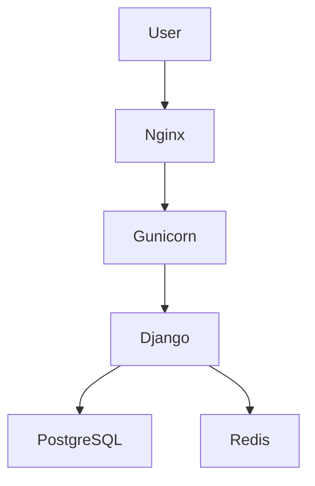
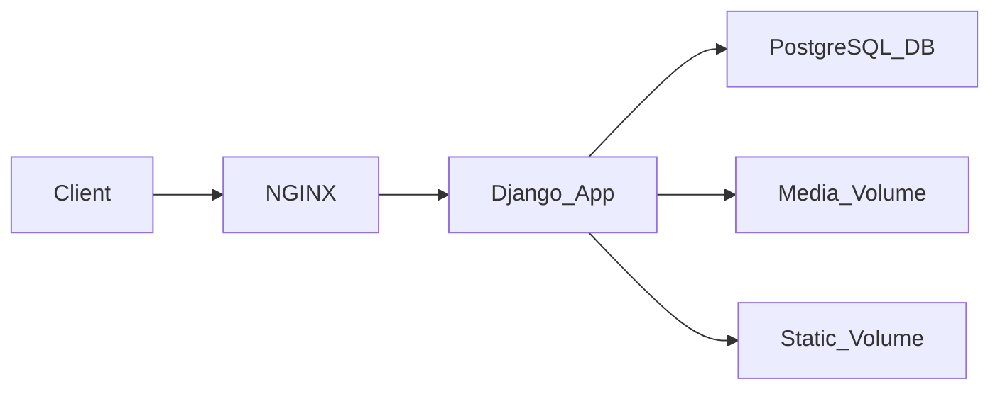

<div align="center">

# 👨‍💻 Ky Ludovic Magloire

**Full-Stack Developer | DevOps Enthusiast**

🎓 Licence 3 Réseau et Génie Logiciel – Pigier Côte d'Ivoire  
🎓 BTS Informatique et Développement d'Application

[](https://github.com/kylma04)

</div>

---

## 🧑‍💻 About Me

Je suis développeur **Full-Stack orienté DevOps**, passionné par :

- 🌐 La conception d'applications web complètes
- ⚙️ L'automatisation des déploiements
- 🏗️ L'architecture backend
- 🖥️ L'infrastructure serveur

Je travaille sur toute la chaîne :

```
Frontend → Backend → Database → Infrastructure → Deployment
```

---

## 🧠 Tech Stack

### 💻 Frontend


### ⚙️ Backend


### 🗄️ Databases


### ⚡ DevOps & Infrastructure


---

## 🚀 DevOps Skills

<table>
<tr>
<td valign="top" width="33%">

**Infrastructure**
- VPS Deployment (Linux / Windows)
- Docker & Docker Compose
- NGINX Reverse Proxy
- SSL / HTTPS configuration
- Gunicorn application server

</td>
<td valign="top" width="33%">

**Automation**
- CI/CD avec Git
- Scripts bash de déploiement
- Containerisation d'applications
- Gestion des volumes Docker

</td>
<td valign="top" width="33%">

**Sécurité**
- Authentification JWT
- 2FA par email
- Logs d'activité utilisateur
- Gestion des permissions

</td>
</tr>
</table>

---

## 🏗️ Architecture Exemple

### Django Deployment



### Docker Stack



---

## 📦 Projets

### 🛍️ HOLY'S BEAUTY — E-commerce
> **Stack :** React + Django Ninja

- 🛒 Catalogue produits & panier
- 📄 Génération PDF des commandes
- 💬 Envoi automatique via WhatsApp
- 🔧 Dashboard admin complet (gestion produits & commandes)

---

### 📊 Gestion des absences — TechShelter Africa
> **Stack :** Ruby on Rails

- 👥 Gestion des participants
- 📅 Suivi des absences
- 📈 Statistiques & visualisation graphique

---

### 🐄 Application de gestion de ferme
> **Stack :** Laravel + React

- 🐾 Gestion animaux, alimentation, vaccins
- 🌡️ Suivi climatique
- 💰 Cycle de vente
- 🧬 Prévention de consanguinité

---

### 📊 API de génération Excel
> **Stack :** Flask + xlwings + pandas + openpyxl

- 📤 Génération de rapports Excel automatisés
- 🖥️ Hébergée sur VPS Windows

---

## 🖥️ Infrastructure Virtuelle

Infrastructure composée de :

| Serveur | OS | Rôle |
|---|---|---|
| 2x | Windows Server | Services Windows |
| 2x | Ubuntu Desktop | Stations de travail |
| 1x | Ubuntu Server | Serveur SSH central |

> Permet aux étudiants de se connecter via **SSH** pour exécuter des traitements Python & Stata.

---

## 📊 GitHub Stats

<div align="center">


</div>

---

## 🐍 Contribution Snake

<div align="center">


</div>

---

## 📚 Interests

```
🚀 DevOps          ☁️ Cloud Infrastructure    🏗️ Backend Architecture
🔒 App Security    🤖 Artificial Intelligence
```

---

## 📫 Contact

<div align="center">

[](mailto:kyludovic@gmail.com)
[](https://github.com/kylma04)
[](https://github.com/kylma04)

</div>

---

<div align="center">

⭐ **Objectif : construire des applications robustes, sécurisées et scalables.**

</div>
