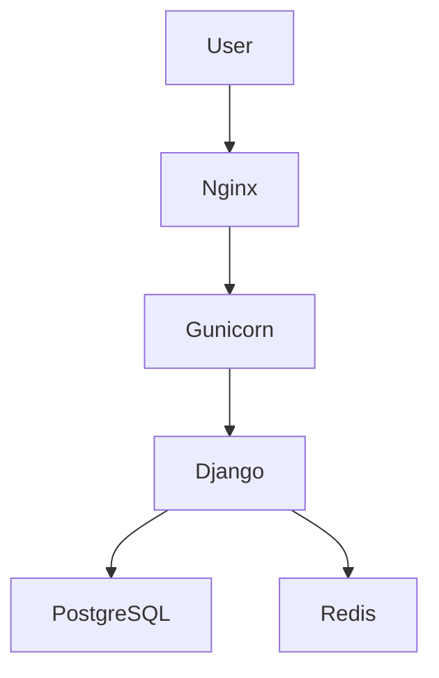
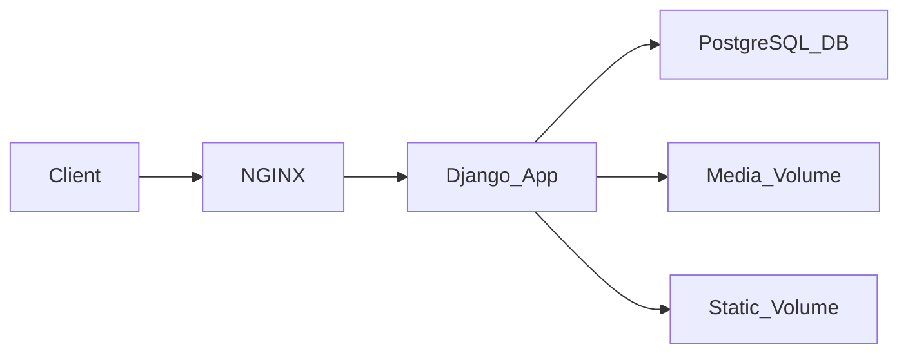

# 👨‍💻 Ky Ludovic Magloire

<div align="center">

🔥 Full-Stack Developer | DevOps Enthusiast  

🎓 Licence 3 Réseau et Génie Logiciel – Pigier Côte d'Ivoire  
🎓 BTS Informatique et Développement d’Application  

</div>

---

# 👀 Visitors


---

# 🧑‍💻 About Me

Je suis développeur **Full-Stack orienté DevOps**, passionné par :

- la conception d’applications web complètes
- l’automatisation des déploiements
- l’architecture backend
- l’infrastructure serveur

Je travaille sur toute la chaîne :

```
Frontend → Backend → Database → Infrastructure → Deployment
```

---

# 🧠 Tech Stack

## 💻 Frontend


---

## ⚙️ Backend


---

## 🗄 Databases


---

## ⚡ DevOps & Infrastructure


---

# 🧠 DevOps Skills

### Infrastructure

- VPS Deployment (Linux / Windows)
- Docker & Docker Compose
- NGINX Reverse Proxy
- SSL / HTTPS configuration
- Gunicorn application server

### Automation

- CI/CD avec Git
- scripts bash pour déploiement
- containerisation d'applications
- gestion des volumes Docker

### Sécurité

- Authentification JWT
- 2FA par email
- logs d’activité utilisateur
- gestion des permissions

---

# 🚀 Architecture Exemple (Django Deployment)



---

# 🐳 Architecture Docker



---

# 📦 Projets

## 🛍 HOLY'S BEAUTY — E-commerce

Stack :

React + Django Ninja

Fonctionnalités :

- catalogue produits
- panier
- génération PDF commandes
- envoi WhatsApp
- dashboard admin
- gestion produits
- gestion commandes

---

## 📊 Gestion des absences (TechShelter Africa)

Stack :

Ruby on Rails

Fonctionnalités :

- gestion participants
- suivi absences
- statistiques
- visualisation graphique

---

## 🐄 Application de gestion de ferme

Stack :

Laravel + React

Gestion :

- animaux
- alimentation
- vaccins
- climat
- cycle de vente
- prévention consanguinité

---

## 📊 API de génération Excel

Stack :

Flask  
xlwings  
pandas  
openpyxl  

API hébergée sur **VPS Windows** pour générer des rapports Excel automatisés.

---

# 📊 GitHub Stats


---

# 📊 Most Used Languages


---

# 📈 GitHub Contribution Graph


---

# 🔥 GitHub Streak


---

# 🐍 Contribution Snake


---

# 🖥 Virtual Infrastructure Project

Infrastructure composée de :

- 2 Windows Server
- 2 Ubuntu Desktop
- 1 Ubuntu Server

Objectif :

permettre aux étudiants de se connecter via **SSH** pour exécuter des traitements :

- Python
- Stata

---

# 📚 Interests

- DevOps
- Cloud Infrastructure
- Backend Architecture
- Application Security
- Artificial Intelligence

---

# 📫 Contact

📧 Email : kyludovic@gmail.com  

🌍 Côte d'Ivoire  

💻 GitHub : https://github.com/KyLudovic

---

⭐ Objectif : construire des **applications robustes, sécurisées et scalables.**
